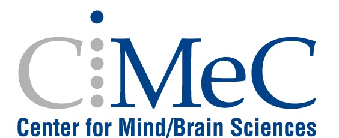

CIMeC MRI Lab Wiki
=======================================
The MRI Lab has developed a comprehensive Wiki that is hosted on ReadTheDocs, a platform designed for sharing and maintaining detailed documentation. This Wiki serves as a centralized repository of information specifically tailored to the MRI Lab’s rules, equipment, and operational practices.

It covers a wide range of topics, including laboratory protocols, guidelines for using the available equipment, safety procedures, and best practices for conducting experiments. The Wiki also addresses frequently asked questions to help researchers and staff quickly find answers to common queries.

This resource was created by the MRI Lab staff with the goal of streamlining operations, promoting safe and effective practices, and ensuring consistency in the use of the lab’s facilities. By centralizing this information in a user-friendly format, the Wiki serves as an invaluable tool for both internal team members and external collaborators.

The Wiki is publicly accessible via ReadTheDocs, making it easy for researchers, students, and other stakeholders to familiarize themselves with the lab’s specific procedures and technical details. Whether you are preparing to conduct an experiment, learning about the lab’s equipment, or seeking clarification on policies, the MRI Lab Wiki is designed to provide clear and concise information.
