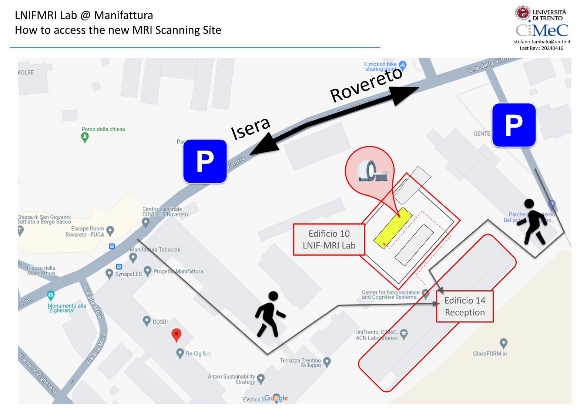

Welcome to CIMeC's MRI Lab Wiki!
===========================

.. warning::
  This Wiki is provided by MRI Lab Staff, is about MRI Lab specific rules, equipment, practices, etc... For general CIMeC infos, see `CIMeC General Wiki <https://wiki.cimec.unitn.it/tiki-index.php?page=Home>`_.

.. toctree::
  :maxdepth: 1
  :caption: Content

  pages/shortcuts
  pages/accessrules
  pages/equipment
  pages/bestpractices
  pages/mrdatamanagement
  pages/facilitycosts
  pages/howto
  pages/resources
  pages/FAQ
  pages/contacts

Center for Mind/Brain Sciences (CIMeC): Outline
===================================

`CIMeC <https://www.cimec.unitn.it/en>`_ is an Interdepartmental Center formed by the Departments of Psychology and Cognitive Sciences, Letters, Mathematics, Physics and Engineering and Information Science (DISI), dedicated to the study of the organization of the brain through the analysis of its functional, structural and psychological characteristics, in normal and pathological conditions. State-of-the-art instrumentation includes functional neuroimaging, MEG, EEG, NIRS, TMS and eye tracking instrumentation, alongside systems for kinematics study.

For the strong integration between scientific research, teaching and clinical area, the Center works in close synergy with other structures of the University interested in the area of Cognitive Sciences, in particular with the Department of Psychology and Cognitive Sciences.
The research activities conducted within the CIMeC are developed in different areas, ranging from experimental psychology, to neuroimaging acquisition methods, to cognitive neuroscience, animal cognition, and finally to Computational Linguistics and Man-Machine Interfaces. In addition, the CeRiN, Center for Neurocognitive Rehabilitation is dedicated to the diagnosis and treatment of pathologies resulting from brain damage.

The research is carried out in the five interdisciplinary `laboratories <https://www.cimec.unitn.it/en/42/laboratories>`_. that make up CIMeC: the Neuroimaging Labs, the Neuropsychology Labs, the Centre for Neurocognitive Rehabilitation, the Computational Cognition Laboratory, the Labs for Experimental Psychology and the Lab for Animal Cognition and Comparative Neuroscience.

CIMeC's MRI Lab: Mission
===================================
The MRI Lab allows users to acquire advanced human MRI data (e.g. fMRI, DTI, VBM, Spectroscopy) with cutting-edge MRI technologies. The mission of the lab is to provide a safe and effective environment to its users, in order to allow them to focus exclusively on the scientific content of their experiment.

CIMeC's MRI Lab: How to reach us
===================================
Where we are:
  `Rovereto Manifattura <https://maps.app.goo.gl/h1kJoeKancYbxb1r6/>`_

  By car
    ~~~~~~~~~~
    A22 Brennero Motorway, exit "Rovereto nord".
    
  By bus
    ~~~~~~~~~~
    Rovereto can be reached with Flixbus from Austria, Germany and several Italian cities and the airport "Orio al Serio" located in Bergamo. The bus stops in front of the train station, which is about 10 minutes walk from the headquarters of the CIMeC.
    
  By train
    ~~~~~~~~~~
    Visit `Trenitalia <https://www.trenitalia.com/en.html>`_ to see up-to-date schedules for the location you are arriving from as well as to purchase your ticket online. Your arrival station is Rovereto, which is about 10 minutes walk from the headquarters of the CIMeC.
    
  By plane
    ~~~~~~~~~~
    The closest airport is `Valerio Catullo of Villafranca Verona <https://www.aeroportoverona.it//>`_. The airport is connected by a shuttle with the central train station Verona "Porta Nuova", from which you can reach Rovereto by train.

Here you can find a map to help you access the MR Lab:

