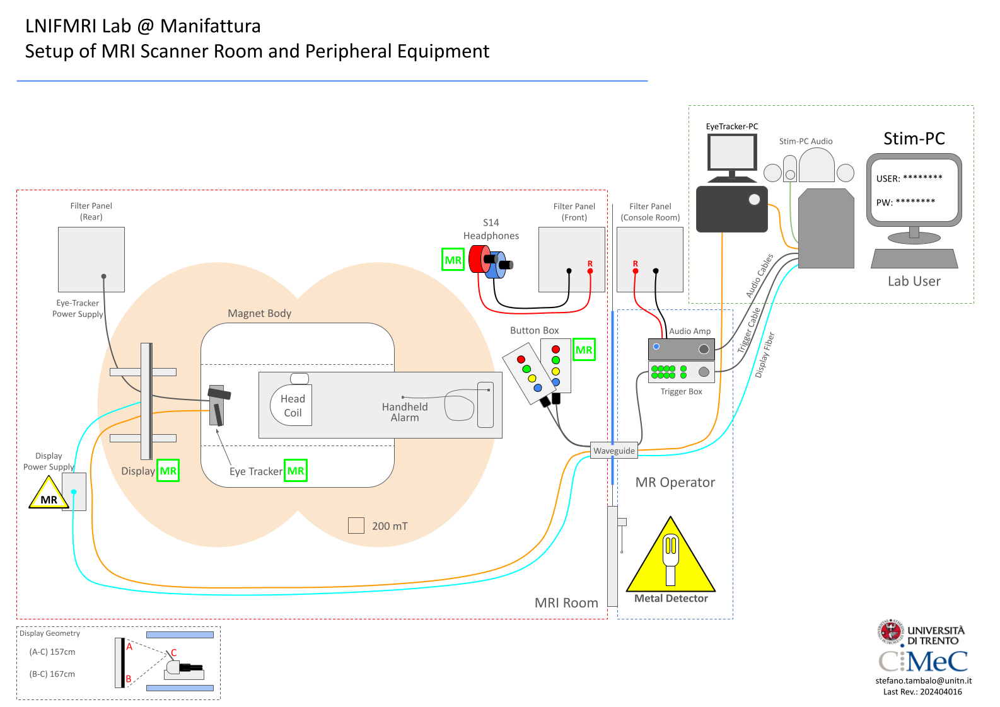

Equipment
==========
*to be implemented*

MRI Scanner
--------

`Siemens Prisma 3T <https://www.siemens-healthineers.com/magnetic-resonance-imaging/3t-mri-scanner/magnetom-prisma>`_:
  * actively shielded;
  * whole body 3T magnet;
  * 80mT/m gradients with a slew rate of 200 T/m/s;
  * 20ch and 64ch Head/Neck RF Coil for experimental neuroimaging applications.

Peripheral Equipment
----------
  * 40" LCD monitor for visual stimuli from `Nordic NeuroLab <https://www.nordicneurolab.com/products/inroomviewing-device>`_ (NNL), always inside the Magnet room (see `Visual Presentation <https://cimec-wiki.readthedocs.io/en/latest/pages/equipment.html#visual-presentation>`_ section in this page);
  * 2 x 4 Button Response Pads (`Current Designs <https://www.curdes.com/mainforp/responsedevices/hhsc-2x4-l.html>`_);
  * Button Response Pads Interface (`Current Designs <https://www.curdes.com/mainforp/interfaces/fiu-932b.html>`_);
  * MR compatible glass frames for adult and pediatric subjects, max visual correction from -6 to +6 with intervals of 0.5 (`Cambridge Research System <https://www.crsltd.com/mri-patient-comfort-communication-and-entertainment/mri-patient-comfort/mediglasses/mediglasses-for-fmri/>`_);
  * Tactile Piezoelectric Stimulator, 2 x 5 fingers (`QuaeroSys <https://www.quaerosys.com/index.php?lang=en&page=piezostimulator>`_);
  * Eye Tracker (`Eyelink <https://www.sr-research.com/fmri-meg-systems/>`_);
  * hPysiological data monitoring and recording (ECG, pOx, Resp tracking);

Stimulation PCs
---------

MRI Lab provides the researchers with:
  * a Stimulation PC located in the control room, connected to the Peripheral Equipment within the Magnet room and equipped with a stimulation software. The Stim-PC can receive triggers from the scanner and responses from the NNL ButtonBox systems;

  * a Training PC, clone of the Stim-PC, can be found in the MRI Area and used to test paradigms and to train subjects outside the MR Scanner.

 * Stim-PC stays offline. Researchers should come with a USB Drive with their flies;
 * Stim-PC is not updated on researchers requests. Current software equipment was judgeg as stable and powerful enough for most of the experiments, specific requests could be evaluated and implemented by MR Lab staff;

HW Specs
~~~~~~~~~~
  * CPU: `Intel Core i7-13700 <https://www.intel.com/content/www/us/en/products/sku/230490/intel-core-i713700-processor-30m-cache-up-to-5-20-ghz/specifications.html>`_, up to 5.2 Ghz, 16 Cores
  * GPU: `NVIDIA GeForce RTX 4060 <https://www.nvidia.com/en-gb/geforce/graphics-cards/40-series/rtx-4060-4060ti/>`_
  * RAM: 2x16Gb 4400Mhz

The Stim-PC is connected to the NNL Monitor, used to present visual stimuli. Images can be seen by the subject through a mirror put on the Head/Neck Coil.

SW Specs
~~~~~~~~~~

Here you can find the list of installed software:
 * Audacity 3.4.2
 * E-Prime 3.0 Subject Station 3.0.3.214
 * EyeLink Developer's Kit 2.1.762.0
 * MATLAB R2017b
 * MATLAB R2022b
 * Tachyon

Instructions for users
~~~~~~~~~~
  * Access to Stim-PC: the password is printed on LCD monitor in the control room. You must log in locally, the PC has not Internet connection;
  * Connection: use a portable device (most likely an USB Drive) to copy your script in the designed folder on the Stim-PC.

Updates and Development
------
The descripted hardware and software equipment is the standard configuration of the Stim-PC. Updates made by MRI Lab will be announced in advance and described to the users.

Potential specific configurations should be requested by sending an email to MRI Lab staff.

The staff will discuss if and how implement requested changes in the lab environment.

Button Response Pads Interface
------
Signals coming from Scanner Room are managed by the Button Response Pads Interface (aka Button Box), which is connected to the Button Response Pads through a optic fiber cable and to the scanner through a BNC cable.

Button Box is in turn connected to the Stim-PC through USB. Stim-PC collect signal from the scanner room as if it was an external USB keyboard.

This means that whenever a signal is sent from within scanner room, numbers appear on the Stim-PC. Keep this in mind when you need to collect responses within your MATLAB code.

Scanner Sync
--------
The scanner, during functional acquisitions, sends a 50μs "pulse" every TR, marking in this way the "volumes" of your MRI experiment.

Synchronization with the scanner trigger is provided through a BNC cable connected to the Button Box, attached to Stim-PC via a USB Port.

Stim-PC collect triggers as if someone was systematically pressing ``5`` key (the one located in the alphanumeric part of the keyboard) at the beginning of each volume acquisition.

This means that in debugging, you can test your scripts by simply accepting ``5`` key.

Participants' responses
----------
MRI Lab provides two 4-button boxes for the participant to send responses while performing inside the scanner.

Buttons are arranged in a linear way. They are marked as right and left through a duct tape. They send, respectively, ``1`` ``2`` ``3`` ``4`` and ``6`` ``7`` ``8`` ``9`` keys to Stim-PC.

You can check the responses by focusing on the Button Box during the experiments. Specific green leds light up when a button is pressed.

Visual Presentation
---------
For the visual stimuli presentation, MRI Lab provides a compatible NNL LCD monitor positioned at the back of the magnet bore.

Basic monitor specs include:
 * 40" (878 mm horizontal x 485 mm vertical);
 * 3840 x 2160 pixels;
 * surface luminance 350 c/m2;
 * contrast ratio 5000:1 typ;
 * refresh rate: 60Hz@2160p, 120Hz@1080p.

For more specs, see `Nordic NeuroLab <https://www.nordicneurolab.com/products/inroomviewing-device>`_.

Auditory Presentation
----------
Current setup includes very basic auditory capabilities. Participants can hear auditory stimuli sent from Stim-PC through earplugs.

Currently there is no possibility to work with different channels, fine-tune the equalisation or record participants' voice.

Peripherals Scheme
--------------
Here you can find a schematic representation of how the peripheral equipment is connected to the MR scanner and the Stim-PC:

Help
-------
You can always send an email to `MR Lab Staff <https://cimec-wiki.readthedocs.io/en/latest/pages/contacts.html>`_ asking generic questions.

In this way the whole staff will notice your request and specific staff memebers would combine their efforts to provide you an answer.
