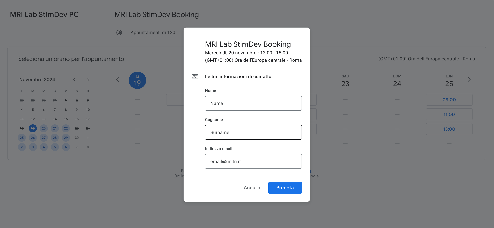

How To ... WIP
============

Stim-PC Booking
---------------

Open the "Book your appointment" link on `Best Practices <https://cimec-mrilab-wiki.readthedocs.io/en/latest/pages/bestpractices.html#code-testing>`_ page of the Wiki.

It opens this page where you have to select the slot(s) that you want to book:

After you have selected the slot there will be a Pop-up where you need to insert your Name, Surname and Institutional Email:

.. warning::
  If the slot is booked without an Institutional Email, the reservation will be canceled.

Press the "Prenota" button to confirm the booking, there will be a confirmation message in the same Pop-up:

Check if you have the event on your calendar:

